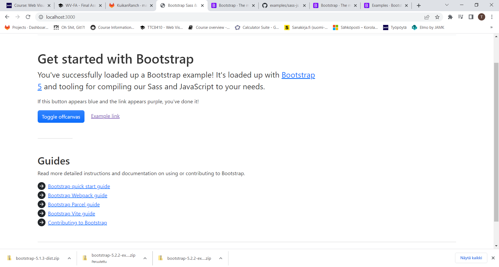

# Dokumentaatio lopputyöstä

Aloitin lataamalla Bootstrapin v5 templaten Bootstrapin kotisivuilta. Se sisälsi jo valmiina SASSin sekä tarvittavat js-paketit sekä ikonit, joita tarvitsen. Tästä on helppo lähteä liikkeelle.

Heti ensimmäiseksi jouduinkin päivittämään npm:n, jotta sain haavoittuvuudet korjattua, tämän jälkeen sain serberin käyntiin:
